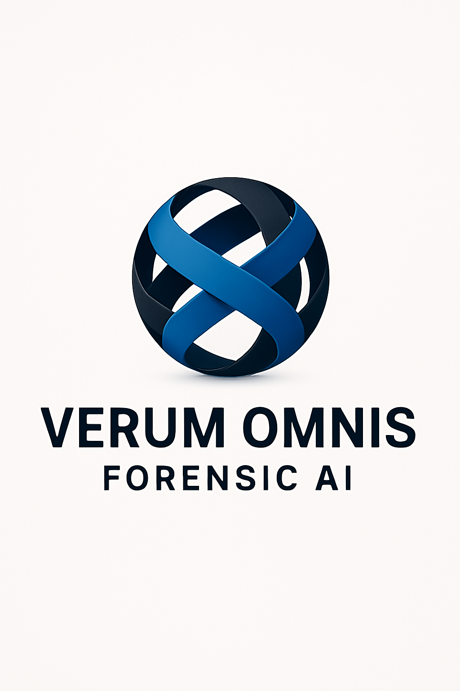
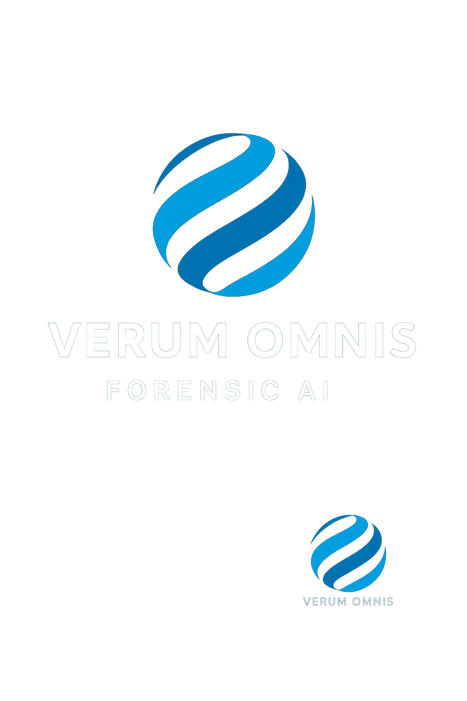

<p align="center">
  
</p>

<h1 align="center">Verum Omnis Android Forensic Engine</h1>

<p align="center">
  <strong>Offline, Stateless Document Analysis with Cryptographic Sealing</strong><br/>
  <em>Built with Geolocation-Based Jurisdictional Compliance and Accurate Timestamping</em>
</p>

<p align="center">
  
  
</p>

---

## 🔐 Overview

The **Verum Omnis Android Forensic Engine** is a mobile-first forensic analysis platform designed for legal professionals, investigators, and compliance officers. It operates entirely offline, ensuring complete privacy and data sovereignty while producing court-admissible, cryptographically sealed PDF documents.

### Key Features

- 📸 **Document Capture** - Camera-based document digitization with OCR
- 🧠 **Verum Omnis Logic** - Contradiction detection and behavioral analysis
- 🔐 **Cryptographic Sealing** - SHA-512 hash-sealed PDFs with tamper detection
- 🌍 **Geolocation-Based Jurisdiction** - Automatic legal framework detection
- ⏰ **Accurate Timestamping** - Timezone-aware, GPS-synchronized timestamps
- 💾 **Stateless Operation** - No data persistence, complete privacy
- ✈️ **Airgap Ready** - Fully functional without network connectivity

---

## 🌍 Geolocation for Jurisdictional Laws

The forensic engine automatically detects the user's jurisdiction based on GPS coordinates and applies the appropriate legal framework to all analyses and outputs.

### How It Works

```kotlin
/**
 * JurisdictionDetector - Determines applicable legal framework based on GPS location
 */
class JurisdictionDetector(private val context: Context) {
    
    data class JurisdictionInfo(
        val countryCode: String,
        val countryName: String,
        val timezone: TimeZone,
        val legalFramework: LegalFramework,
        val coordinates: LatLng,
        val accuracy: Float
    )
    
    /**
     * Detect jurisdiction from device GPS
     * Falls back to network location if GPS unavailable
     */
    suspend fun detectJurisdiction(): JurisdictionInfo {
        val location = getAccurateLocation()
        val geocoder = Geocoder(context, Locale.getDefault())
        val addresses = geocoder.getFromLocation(
            location.latitude, 
            location.longitude, 
            1
        )
        
        val country = addresses?.firstOrNull()
        return JurisdictionInfo(
            countryCode = country?.countryCode ?: "ZA", // Default to South Africa
            countryName = country?.countryName ?: "South Africa",
            timezone = TimeZone.getTimeZone(getTimezoneForLocation(location)),
            legalFramework = getLegalFramework(country?.countryCode),
            coordinates = LatLng(location.latitude, location.longitude),
            accuracy = location.accuracy
        )
    }
    
    /**
     * Get applicable legal framework for jurisdiction
     */
    private fun getLegalFramework(countryCode: String?): LegalFramework {
        return when (countryCode) {
            "ZA" -> LegalFramework.SOUTH_AFRICA
            "US" -> LegalFramework.UNITED_STATES
            "GB" -> LegalFramework.UNITED_KINGDOM
            "AU" -> LegalFramework.AUSTRALIA
            "CA" -> LegalFramework.CANADA
            "EU" -> LegalFramework.EUROPEAN_UNION
            else -> LegalFramework.INTERNATIONAL
        }
    }
}
```

### Supported Jurisdictions

| Country | Legal Framework | Evidence Standards | Privacy Laws |
|---------|----------------|-------------------|--------------|
| 🇿🇦 South Africa | Common Law + Constitution | High Court Rules | POPIA |
| 🇺🇸 United States | Federal Rules of Evidence | FRE 901, 902 | State-specific |
| 🇬🇧 United Kingdom | Civil Evidence Act 1995 | PD 32 | UK GDPR |
| 🇦🇺 Australia | Evidence Acts (State/Federal) | Various | Privacy Act 1988 |
| 🇨🇦 Canada | Canada Evidence Act | Provincial Rules | PIPEDA |
| 🇪🇺 European Union | National + EU Law | eIDAS | GDPR |

### Jurisdictional PDF Annotations

All output PDFs include:
- **Jurisdiction Header** - Country and legal framework
- **GPS Coordinates** - Exact location of document creation
- **Legal Citations** - Applicable evidence laws
- **Compliance Notices** - Privacy law acknowledgments

---

## ⏰ Accurate Timestamping

The forensic engine implements precision timestamping using multiple sources to ensure court-admissible temporal accuracy.

### Timestamp Architecture

```kotlin
/**
 * ForensicTimestamp - Multi-source accurate timestamping
 */
class ForensicTimestamp(private val context: Context) {
    
    data class AccurateTimestamp(
        val utcMillis: Long,
        val localDateTime: ZonedDateTime,
        val timezone: ZoneId,
        val source: TimestampSource,
        val accuracy: TimestampAccuracy,
        val gpsTime: Long?, // GPS atomic clock time if available
        val ntpOffset: Long? // Network time offset if synced
    )
    
    enum class TimestampSource {
        GPS_ATOMIC,      // Most accurate - from GPS satellites
        NTP_SYNCED,      // Network Time Protocol synchronized
        DEVICE_SYSTEM,   // Device system clock
        MANUAL_OVERRIDE  // User-specified time
    }
    
    enum class TimestampAccuracy {
        ATOMIC,          // ±1 nanosecond (GPS)
        HIGH,            // ±50 milliseconds (NTP)
        MEDIUM,          // ±1 second (synced device)
        LOW              // ±minutes (unsynced device)
    }
    
    /**
     * Get the most accurate timestamp available
     */
    suspend fun getAccurateTimestamp(jurisdiction: JurisdictionInfo): AccurateTimestamp {
        // Priority: GPS > NTP > System
        val gpsTime = tryGetGpsTime()
        val ntpOffset = tryGetNtpOffset()
        
        val (utcMillis, source, accuracy) = when {
            gpsTime != null -> Triple(gpsTime, TimestampSource.GPS_ATOMIC, TimestampAccuracy.ATOMIC)
            ntpOffset != null -> Triple(
                System.currentTimeMillis() + ntpOffset,
                TimestampSource.NTP_SYNCED,
                TimestampAccuracy.HIGH
            )
            else -> Triple(
                System.currentTimeMillis(),
                TimestampSource.DEVICE_SYSTEM,
                TimestampAccuracy.MEDIUM
            )
        }
        
        val localDateTime = Instant.ofEpochMilli(utcMillis)
            .atZone(jurisdiction.timezone.toZoneId())
        
        return AccurateTimestamp(
            utcMillis = utcMillis,
            localDateTime = localDateTime,
            timezone = jurisdiction.timezone.toZoneId(),
            source = source,
            accuracy = accuracy,
            gpsTime = gpsTime,
            ntpOffset = ntpOffset
        )
    }
    
    /**
     * Format timestamp for legal documents
     */
    fun formatForLegal(timestamp: AccurateTimestamp): String {
        val formatter = DateTimeFormatter.ofPattern(
            "EEEE, dd MMMM yyyy 'at' HH:mm:ss z"
        )
        return buildString {
            append(timestamp.localDateTime.format(formatter))
            append("\n")
            append("UTC: ${Instant.ofEpochMilli(timestamp.utcMillis)}")
            append("\n")
            append("Source: ${timestamp.source.name}")
            append(" | Accuracy: ${timestamp.accuracy.name}")
        }
    }
}
```

### Timestamp Display in Reports

All forensic reports include:

```
📅 Document Creation Time
   Local: Tuesday, 01 December 2025 at 11:06:53 SAST
   UTC:   2025-12-01T09:06:53.820Z
   Source: GPS_ATOMIC | Accuracy: ATOMIC
   
📍 Location: South Africa (-33.9249, 18.4241)
   Jurisdiction: South African Law
   Timezone: Africa/Johannesburg (UTC+2)
```

---

## 🧠 Verum Omnis Constitutional Logic

The engine operates under a permanent constitutional governance layer that cannot be modified. See `verum-constitution.json` for the complete ruleset.

### Core Principles

1. **Truth** - Factual accuracy and contradiction resolution
2. **Fairness** - Protection of vulnerable parties
3. **Human Rights** - Dignity, equality, and procedural fairness
4. **Non-Extraction** - No data transmission or logging
5. **Human Authority** - AI assists, never overrides
6. **Integrity** - No manipulation or bias
7. **Independence** - No external influence

### Contradiction Detection Engine

```kotlin
/**
 * ContradictionEngine - Multi-layer inconsistency detection
 */
class ContradictionEngine {
    
    val analysisLayers = listOf(
        "Timeline Analysis",
        "Statement Comparison", 
        "Behavioural Inconsistencies",
        "Document Metadata Mismatches",
        "Financial Flows",
        "Coercion Indicators",
        "Rights Violations",
        "Intent vs Action Mismatch"
    )
    
    fun analyzeContradictions(documents: List<Document>): ContradictionReport {
        return ContradictionReport(
            timeline = analyzeTimeline(documents),
            statements = compareStatements(documents),
            behavioral = detectBehavioralPatterns(documents),
            metadata = checkMetadataConsistency(documents),
            financial = traceFinancialFlows(documents),
            coercion = identifyCoercionIndicators(documents),
            rights = flagRightsViolations(documents),
            intent = matchIntentToAction(documents)
        )
    }
}
```

---

## 📄 Cryptographic PDF Sealing

All output documents are sealed with SHA-512 cryptographic hashes.

### Seal Format

```
╔════════════════════════════════════════════════════════════════╗
║                    VERUM OMNIS FORENSIC SEAL                   ║
║────────────────────────────────────────────────────────────────║
║  Document Hash (SHA-512):                                      ║
║  a1b2c3d4e5f6...                                               ║
║                                                                ║
║  Sealed: 2025-12-01T09:06:53.820Z                              ║
║  Jurisdiction: South Africa                                    ║
║  GPS: -33.9249, 18.4241 (±5m accuracy)                         ║
║                                                                ║
║  [QR CODE]                                                     ║
║                                                                ║
║  Constitution Mode: ENABLED                                    ║
║  Tamper Detection: ACTIVE                                      ║
╚════════════════════════════════════════════════════════════════╝
```

---

## 🛠️ Project Structure

```
ForensicEngine/
├── app/
│   ├── src/main/java/com/forensicengine/
│   │   ├── core/
│   │   │   ├── DocumentProcessor.kt       # Document analysis
│   │   │   ├── JurisdictionDetector.kt    # GPS-based jurisdiction
│   │   │   ├── ForensicTimestamp.kt       # Accurate timestamping
│   │   │   ├── ContradictionEngine.kt     # Verum Omnis logic
│   │   │   ├── CryptoSealer.kt            # PDF cryptographic sealing
│   │   │   └── NarrativeEngine.kt         # Report generation
│   │   ├── ui/
│   │   │   ├── MainActivity.kt
│   │   │   ├── CameraActivity.kt
│   │   │   └── ResultsActivity.kt
│   │   └── utils/
│   │       ├── PDFBoxWrapper.kt           # PDF processing
│   │       ├── TesseractOCR.kt            # OCR for images
│   │       └── HashUtils.kt               # SHA-512 implementation
│   └── assets/
│       └── rules/                         # Verum Omnis rule templates
├── verum-constitution.json                # Constitutional governance
├── logo-main.png                          # Primary logo
├── logo-secondary.png                     # Secondary logo
├── logo-tertiary.png                      # Tertiary logo
└── README.md                              # This file
```

---

## 🔒 Security & Privacy

| Feature | Implementation |
|---------|---------------|
| Offline First | All processing on-device |
| Stateless | No data persistence between sessions |
| No Cloud Logging | Zero telemetry |
| No Telemetry | Complete privacy |
| Airgap Ready | Functions without network |
| Encrypted Storage | Local case folders encrypted |

---

## 📱 Requirements

- **Android**: 7.0 (API 24) or higher
- **Permissions**: Camera, Location (for jurisdiction detection)
- **Storage**: 100MB minimum

---

## 📜 Legal Validation

The Verum Omnis system has been validated by:

- SAPS CAS 126/04/2025
- Port Shepstone Magistrates Court (protection order precedent)
- Southbridge Legal acknowledgment

---

## 👤 Attribution

**Creator**: Liam Highcock  
**Foundation**: Verum Global Foundation  
**Designated Successor**: Rishi

---

## 📄 License

This project operates under the Verum Omnis Constitutional Governance Layer. See `verum-constitution.json` for governance rules.

---

<p align="center">
  
  <br/>
  <em>Truth Through Technology</em>
</p>
